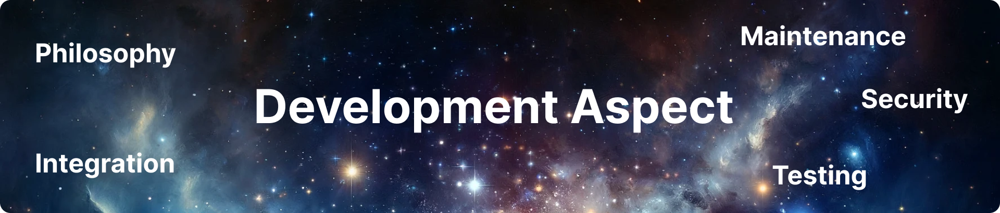
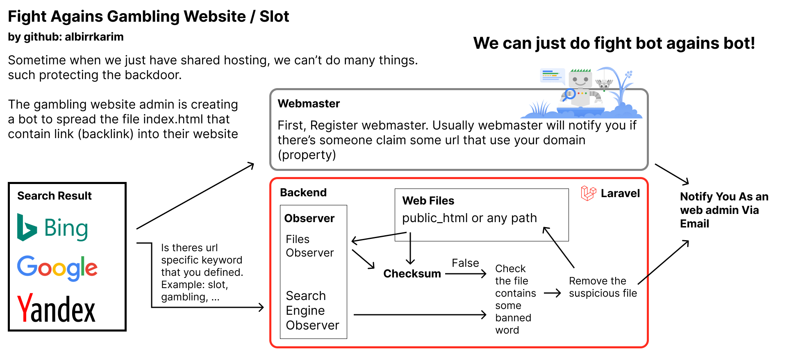

# Laravel React Starter Kit PRO

A solid and efficient project foundation for laravel and react full stack development.

## Docs for v1.0.0

Starter Kit / Boilerplate for Laravel 11 and React 18

**Table Of Contents**

- [A. Introduction](#a-introduction)
- [B. Compare to Other Architecture](#b-compare-to-other-architecture)
- [C. Development Aspect](#c-development-aspect)
- [D. Todo](#d-todo)
- [E. Example Code](#e-code)
- [F. Changelog](#f-changelog)
- [G. Disclaimer & Warranty](#g-disclaimer--warranty)
- [H. FAQ](#h-faq)

## A. Introduction

### Problem

Long time ago, i was new in field of full stack developer. I do few reseach which one should i use for my tech stack based on the popularity world wide. [laravel is most popular in backend 2023](https://statisticsanddata.org/data/most-popular-backend-frameworks-2012-2023/) and still most popular in [2024](https://www.mindinventory.com/blog/best-backend-frameworks/), [react js is most popular in javascript](https://www.simform.com/blog/best-frontend-frameworks/), so i choose my tech stack is [laravel](https://laravel.com) and [react js](https://react.dev), i know little bit of laravel and react. I don't know the best practice, and functions that react and laravel already have to do some logic. The steps i use to learn something: learn few -> just do it -> improve (best practice etc)

**How about reading the documentation?**

The laravel and react, have a lot of features and helper functions. and ofcourse they make a lot documentations. The problem is we have to read **a lot** of the documentation so we understand the best practice.

### Solutions

#### Many ways you can do

1. The first solution is use Code AI Assistant

   Using [chat gpt](https://chat.openai.com), copy the code you have made and ask chat gpt to modify it into best practice. this method you will be open and close chat gpt offer time. (it wasting time). The gpt3.5 is more often give me wrong code, so i do pay for subscription to the chat gpt plus with gpt4 and they solve about 90% code logic problem that i face.

   Another option is you using [Github Copilot](https://github.com/features/copilot) its free for github pro user / student. They act as chat gpt that can edit your code directly from your [vs code](https://code.visualstudio.com). Still they cant prepare all the basic code and integration, they can just do one by one code modify (per file). you still need to prepare manually.

2. Using Template and Boilerplate.
   I also use paid template. (ensuring they maintain the dependencies update). How about boilerplate? many boilerplate is just opensource repo. that is not well maintenance. outdated dependencies, outdated integration method. etc.

3. Using [Starter Kit From Official Laravel](https://laravel.com/docs/11.x/starter-kits).

   They provide, good starting point, but still its too basic for real production.

#### Finally


So i made this starter kit to ensure the the dependencies is maintained, integration is seamless, also the security, everthing just work, documented, and have system overview.

Maybe you are project manager that also want this thing, so you can easily explain to your team about your project and the tech stack do you use using our overview.


Folder structures:


## B. Compare to Other Architecture

1. Why not to use laravel + inertia js + react js

   The main purpose of [inertia](https://inertiajs.com/) is to provide [SSR (Server Side Rendering)](https://www.searchenginejournal.com/client-side-vs-server-side/482574) capability, interia js will provide the data (rendered in server without api call) and use the data to render in client using react.

    <details>
      <summary>Show detail why not use inertia</summary>

      <br/>

   **SSR Aspect**

   When you try to achive same SSR the [next js](https://nextjs.org) performs better, because they keep the html structure.

   Go to here [demo.inertiajs.com/](https://demo.inertiajs.com) and [nextjs.org](https://nextjs.org/) and do right click > view page source.

   - Inertia Demo

   

   - Next js

   

   You can see the inertia just supply the data. and not keeps the html structure. The next js keeps the html structure, ofcourse the search engine bot will understand better of your page.

   **Testing Aspect**

   I just want simple testing for my app using with just what response of an API, if you use inertia, they handle the api request, so i can't make program as the middle man that can record the request and response data.

   **Integration Aspect**

   Many frontend templates, like in the [material ui template](https://mui.com/store) i using API as the bridge, between frontend and backend. of course using JWT.

    </details>

<br/>

2. Why not to use vue

   Go to [this article](https://www.techmagic.co/blog/reactjs-vs-angular-vs-vuejs) you will find why.

<br>
<br>

## C. Development Aspect



### Philosophy

Make it simple, easy to learn and teach to your teams, real production case, and efficient labour cost.

### Integration

Provide best practice to make the data APIs.

- Routing

  Well route naming, grouping, versioning.

- Handling Form Request (CRUD) from the frontend

- Ready make email integration

  Email verification, forgot password. you just setting the SMTP (tutorial is included in the readme on private repo)

- We need AI

  In this package has example of using [open ai api](https://openai.com/product) and the [elevenlabs](https://elevenlabs.io/?from=partnermurray4444) (text-to-speech services) the [laravel (backend) is act as forwarder to keeps the secret key is secure](https://help.openai.com/en/articles/5112595-best-practices-for-api-key-safety).

- [Google Tag Manager](https://marketingplatform.google.com/about/tag-manager/)

  Google tag manager is something that can manage and combines many analytics like google analytics, fb analytics, etc.

  Usualy i just combine it with [Google Analytics](https://marketingplatform.google.com/about/analytics/)

### Security

Provide some example for authentications and securing laravel.

#### Sign In

- Fingerprint login
- Pin login

#### APIs

- Using JWT ([Json Web Token](https://github.com/PHP-Open-Source-Saver/jwt-auth))
- Throthling (rate limiter)

#### Protect Using Bot

Sometime when we just have shared hosting, we can’t do many things. such protecting the server backdoor. The gambling website admin is creating a bot to spread the file index.html that contain link (backlink) into their website. So we must fight their bot agains our bot protector.



### Maintenance

I keep this package designed to be simple, less dependencies, designed for making common website. Always updated with current version. This starter kit is keeps to its latest version when at the end of the month. (monthly update)

**Front end main dependencies:**

- [React js](https://react.dev/)

  React offer reuseable component and good interactifity compares to other old js library like [jquery](https://jquery.com/). react has drawback when the programmer is new in react, they don't know about the react rerender and it can resulting a slow app, lag, or maybe memory leak. Again the experience is needed when deal with react.

- [Material UI](https://mui.com)

  Material ui is widely used, good foundation for frontend, offer very good best practice.

- [Tailwind CSS](https://tailwindcss.com)

  Tailwind offer good ui when you still thing the material ui is not your style.

- [Editor js](https://editorjs.io/)

  Sometimes we need to implement editor that can, do like CMS in wordpress. That can edit long article with good user experience. How can we achieve this in react and laravel? Many options is available like [CKeditor](https://ckeditor.com/) and other. i do research the [Editor js](https://editorjs.io/) is better user experience when we try to make long article content.

- [Apexcharts](https://apexcharts.com)

  Apexcharts is a good choice for displaying your charts.

- [Next js](https://nextjs.org)

  The our basic stack is laravel and react ([client-side rendering](https://www.searchenginejournal.com/client-side-vs-server-side/482574/)). Recently i have project that must do hard competition in [SEO](https://www.searchenginejournal.com/client-side-vs-server-side/482574/). The Server Side Rendering (SSR) is must be used.

  So i combine the next js(offer SSR capability), react js, laravel. also this is exist draw back. your hosting must support for node js hosting, make sure you check the hosting specification.

  We have starter kit with next js version

**Backend main dependencies:**

- [php-open-source-saver/jwt-auth](https://github.com/PHP-Open-Source-Saver/jwt-auth)

### Testing

The purpose of testing is to make sure all function work correctly time after time and feature after feature implemented. Testing is important!

**Common Problem:**

The case is when you try to implement next feature (`X`) sometimes the existing feature (`Y`) is broken.

What you will do ? fix the `Y` feature, then checking manually all other features? Stop, don't manually check the functionality time overtime.

Making automatic testing for laravel is high labour cost. Making test code for backend is difficult when it comes with many posibilities of data modification, how you can make test case for that? its so hard.

In this package i decide to make testing based on the API output, Since, the frontend (react) and backend (laravel) is connected by API.

**Automatic & Easy Way to Testing Laravel**


**Then how you can making test case?**

1. First make sure (now) all the feature is correct

2. Then, They can just doing many interactions click button, fill forms, etc, on app ui. and the test case is generated automatically.

   <details>
     <summary>Show generated test case</summary>

     <br/>

   ```js
   [
     {// Action 1
       send: {
         url:"/api/v1/some_service?q=data that some button send to laravel api service",
         method:"GET",
       }
       received: "data that frontend received from laravel api service"
     },
     {// Action 2
       send: {
         url:"/api/v1/form",
         method:"POST",
         data:"data that some form send to laravel api service"
       }
       received:"data that frontend received from laravel api service"
     },
     // Other user interactions.
   ]
   ```

   </details>

<br/>

3. Then when we want to do testing using [jest library](https://jestjs.io/), My code will doing send request based on the test case. Just run the `npm run test`

   ```js
   const res = // sent to server with information testcase.send
     expect(res).tobe(testcase.send.received);
   ```

   With that method and sequentially doing actions, so the test case will don't care about the data changes, in the database. They just give attention into the final output of the APIs.

4. The finall output of the APIs (response) with correct data and sequentially executed is representing your function inside laravel is working properly. Now the all features have been checked automatically and 100% working so the app ready to be deliver into production.

<br>
<br>

## D. Todo

- [ ] Make video demo
- [ ] Make video tutorial for setup
- [ ] Make video tutorial for the testing

<br>
<br>

## E. Code

In the demo website you will see only the frontend and api mocking (just to simulate api call).

Once you buy you will get inside my [private repo Laravel React Starter Kit PRO](https://github.com/Web-XR-AI-lab/laravel-react-starter-kit-pro)

<br>
<br>

## F. Changelog

Changelog contains information about new amazing feature, fix bug, breaking changes information, and what you should do when the version is update.

See [CHANGELOG.md](CHANGELOG.md)

<br>
<br>

## G. Disclaimer & Warranty

There's no refund, just cancel your subscription in github sponsors menu.

I love feedback from my customers. You can write on the issue tab so when i have time i can try to solve that and deliver for the next update.

<br>
<br>

## H. FAQ

<details>
  <summary>Why is the pricing is high? Why isn't this an open-source package?</summary>

  <br/>

Maintaining, updating, and supporting the Laravel React Starter Kit requires ongoing resources. We've priced it at just $10 USD per month, affordable as a cup of coffee, to ensure it remains sustainable and high-quality.

</details>

<br/>

<details>
  <summary>How often are dependencies updated?</summary>

  <br/>

We update dependencies monthly to ensure the kit remains current with the latest technology standards.

</details>

<br/>

<details>
  <summary>Written in Typescript?</summary>

  <br/>
  
Yes, the frontend component written in [typescript](https://www.typescriptlang.org). the typescript provide good quality code. for example then you hover your mouse into some components, vs code will show some popup that tells you what is that, examples, and more. so you dont have to look into long documentation separately.

You code in vscode and you will easily understand our custom components in vscode also.

</details>

<br/>

<details>
  <summary>Can i use other fancy UI templates?</summary>

  <br/>
  
Yes, this starter kit is not a frontend template. this is the project foundation. [see the ilustration](#finally). this project is a good starting point and solid foundation. Where you can integrate with other Components Packs and templates.

We have made good example folders. that you can put your existing code files or templates.


</details>

<br/>

<details>
  <summary>Can I integrate this starter kit with existing projects?</summary>

  <br/>

When we talk about integration. we must match all aspect in common integration.

**Folder Structure**

Our starter-kit have a good folder structure that make your existing project can easily embeded.


**Dependencies**

The common problem is the dependencies, maybe you have old dependencies and you don't know how to upgrade your deps, don't worry i will tell you how it can done easily with my approach, just chat me on discord.

</details>

<br/>

<details>
  <summary>What kind of support is included with my subscription?</summary>

  <br/>

You can ask me via discord, about some development problems and i will show you the ways you can do (based my own approach).

</details>

<br/>

**Have more questions?**

Feel free to ask any additional questions via Discord: [albirrkarim](https://discord.com/channels/@me/884043164908929034).

<!-- <details>
  <summary></summary>

  <br/>

Yes it is, i

</details> -->

<br/>

## Invest in Efficiency with Just the Cost of a Coffee

Maintaining, updating, and give supports for Laravel React Starter Kit requires continuous work, which is why we offer accessible subscription options—priced like your daily coffee, but with lasting benefits.

When you choose to online meeting with me, i support for indonesian (im from here) and english.

### Pricing Options

#### **1. Private Repository Access**:

- **Price**: $10/month (cancel anytime)
- **Features**: Unlock access to a private GitHub repository and receive chat support via Discord.

#### **2. Dedicated Support**:

- **Price**: $10/hour
- **Service**: Benefit from personalized, one-on-one consultation sessions via online meetings, tailored to address your specific project challenges.

#### **3. Team Training Package**:

- **Price**: $200/month (cancel anytime)
- **Details**: Engage in comprehensive training sessions for your team—22 hours per month over daily one-hour meetings from Monday to Friday, focusing on full-stack development with Laravel and React.

Each option is designed to provide significant value and enhance your project's success. Choose the plan that best fits your needs and start building smarter and faster today.

### The payment is using github sponsors:

<a href="https://github.com/sponsors/albirrkarim" class="sponsor">
    
</a>

<br/>
<br/>

## This is the solution for you who are looking for

- react laravel
- laravel and react
- laravel with react
- laravel backend react frontend
- laravel with react js
- laravel react admin panel
- use react in laravel
- laravel react js
- add react to laravel
- reusable react components
- laravel react project template
- react template that integrate with laravel backend
- SPA laravel react
- laravel react vite
- React Laravel Integration Kit
- react js with laravel backend kit
- laravel-react project github
- react with laravel project example
- Laravel React Project Foundation
- laravel react starter kit
- laravel react boilerplate
- React Laravel Integration
- React Components for Laravel
- Seamless Web Development Kit
- Laravel API with React Frontend
- Laravel 11 Vite React Tailwind Material UI Boilerplate
- Easy way to testing laravel
- Easy API Testing Laravel
- laravel nextjs
- react next js and laravel a practical guide
- next js and laravel integration
